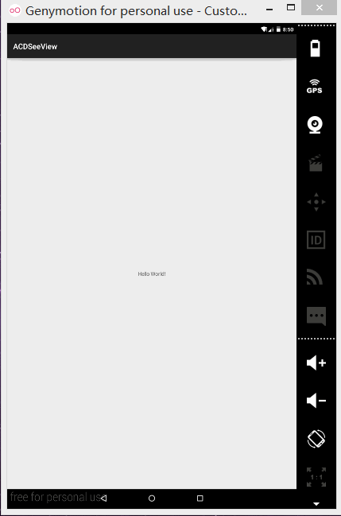
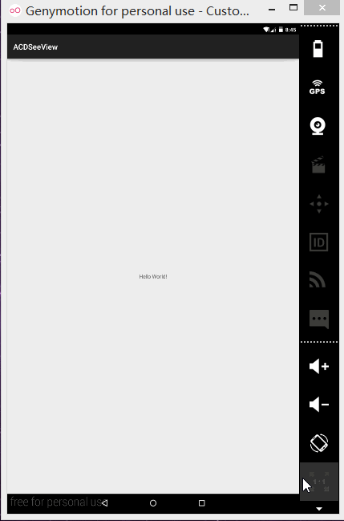

# ACDSeeActivity
A Android ACDSee Activity

Sample Project
--------------
* Two Image



* Thrid Image and more



* Arbitrary position


* No dots


Usage
-----
1. Add the [resources](https://github.com/GitSmark/ACDSeeActivity/blob/master/ACDSeeActivityResourse.rar) into your project.

2. Use the `ACDSeeActivity`.
  
 ```java
  String[] url = new String[]{"", "", ""};
  ACDSeeActivity.start(MainActivity.this, url);
  //ACDSeeActivity.start(MainActivity.this, url, 2, false);
  ```
Same as

  ```java
  String[] url = new String[]{"", "", ""};
  Intent intent = new Intent(MainActivity.this, ACDSeeActivity.class);
  intent.putExtra("ACDSeeData",url);
  //intent.putExtra("ACDSeeItem", 2);
  //intent.putExtra("ACDSeeAdot", false);
  startActivity(intent);
  ```

Customization
-------------------
  Customized whatever you want.
  
Sample
----------
  There is also a [sample](https://github.com/GitSmark/ACDSeeActivity/blob/master/ACDSeeActivityDemo.rar) to get you started.

Contact
--------
  Have problem? Just [tweet me](https://twitter.com/huangxy) or [send me an email](mailto:huangxy8023@foxmail.com).

License
----------

    Copyright 2016 huangxy@GitSmark

    Licensed under the Apache License, Version 2.0 (the "License");
    you may not use this file except in compliance with the License.
    You may obtain a copy of the License at

       http://www.apache.org/licenses/LICENSE-2.0

    Unless required by applicable law or agreed to in writing, software
    distributed under the License is distributed on an "AS IS" BASIS,
    WITHOUT WARRANTIES OR CONDITIONS OF ANY KIND, either express or implied.
    See the License for the specific language governing permissions and
    limitations under the License.


